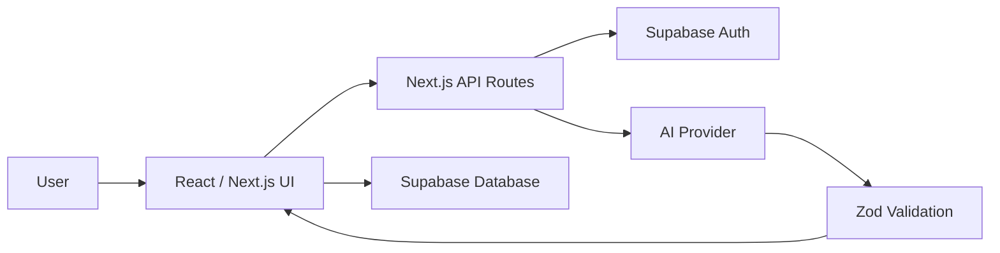

# Wine AI Assistant

**AI sommelier prototype for wine discovery, label scanning, and personal tasting notes.**

Wine AI Assistant is a portfolio project exploring how AI can support wine discovery through natural language search, label analysis, and a personal wine journal.


---

## Project Status

This project is in active development. The README is written to describe the intended product direction and the technical architecture being explored.

Screenshots and a public deployment link will be added when the UI is ready for external review.

---

## What It Is

Wine AI Assistant lets users discover wines through natural language queries, scan bottle labels, and keep a personal wine journal. The project is designed to demonstrate production-minded patterns in AI-integrated frontend development: server-side API handling, Supabase-backed data flows, structured AI output validation, and a composable React component architecture.

---

## Features

- **Natural language wine search** — search for wines by taste, region, food pairing, budget, or occasion.
- **Wine label scanner** — extract useful wine information from bottle labels.
- **Personal wine journal** — save wines, notes, ratings, and pairing ideas.
- **Structured flavor profiles** — acidity, tannin, body, sweetness, and alcohol data visualized in the UI.
- **Multi-provider AI direction** — designed around Anthropic, OpenAI, and Groq provider options.
- **Supabase-backed data model** — auth, database, and user-owned records.
- **Zod validation** — validates structured AI responses before they reach the client UI.

---

## Tech Stack

| Layer | Technology |
|---|---|
| Framework | Next.js 16, App Router |
| Language | TypeScript |
| Styling | Tailwind CSS, shadcn/ui-style components |
| Database/Auth | Supabase |
| State | Zustand |
| AI Providers | Anthropic, OpenAI, Groq |
| Validation | Zod |
| Charts | Recharts |

---

## Architecture Direction

The project is structured around a server-side AI boundary. Client components send user intent to Next.js API routes, API routes call the selected AI provider, and responses are validated before being displayed in the UI.



---

## Getting Started

### Prerequisites

- Node.js 20+
- npm
- Supabase project
- AI provider API key, depending on the selected provider

### Installation

```bash
git clone https://github.com/TigranBabujyan/wine_ai-assistant.git
cd wine_ai-assistant
npm install
```

### Environment Variables

Create a local environment file:

```bash
cp .env.example .env.local
```

Typical variables:

```env
NEXT_PUBLIC_SUPABASE_URL=your_supabase_project_url
NEXT_PUBLIC_SUPABASE_ANON_KEY=your_supabase_anon_key
SUPABASE_SERVICE_ROLE_KEY=your_supabase_service_role_key
ENCRYPTION_SECRET=your_encryption_secret
NEXT_PUBLIC_APP_URL=http://localhost:3000
```

Never commit real API keys or secrets.

### Run locally

```bash
npm run dev
```

Open [http://localhost:3000](http://localhost:3000).

---

## Portfolio Context

This project is intended to demonstrate:

- React and Next.js application architecture;
- AI API integration in a frontend product;
- TypeScript-first development;
- Supabase auth and database usage;
- structured AI response handling with Zod;
- product thinking around a real domain: wine discovery and tasting notes.

---

## Roadmap

- Add public deployment link.
- Add real screenshots and demo media.
- Improve onboarding and empty states.
- Add automated tests for validation and key user flows.
- Expand wine recommendation and food pairing flows.

---

## Author

**Tigran Babujyan**

- GitHub: [github.com/TigranBabujyan](https://github.com/TigranBabujyan)
- LinkedIn: [linkedin.com/in/tigran-babujyan](https://www.linkedin.com/in/tigran-babujyan/)
