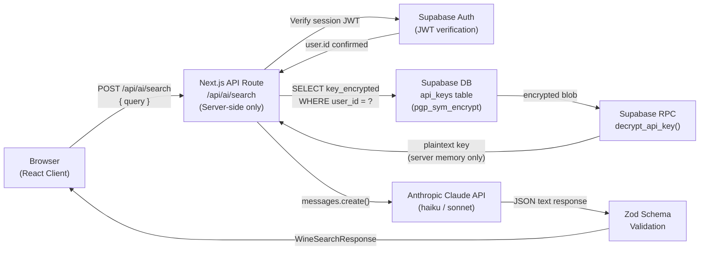

# Wine AI Assistant

**Your personal AI sommelier — discover, scan, and journal wines with natural language.**


[Live Demo →](https://your-deploy-url.vercel.app)

---

## Screenshot


> Add a screenshot of the app here — place the image at `docs/screenshot.png`

---

## What It Is

Wine AI Assistant is a full-stack web application that lets users discover wines through natural language queries, scan bottle labels using their device camera, and maintain a personal wine journal — powered by your choice of AI provider (Anthropic Claude, OpenAI, or Groq).

Built as a portfolio project to demonstrate production-grade patterns in AI-integrated frontend development: server-side key isolation, encrypted credential storage, Row Level Security, structured AI output validation with Zod, and a composable component architecture with shadcn/ui.

---

## Features

- ✅ **Natural language wine search** — ask "bold reds under €20" or "something similar to a Burgundy Pinot Noir"; Claude interprets intent and returns structured recommendations
- ✅ **Wine label scanner** — point your camera at any label; Claude Vision extracts name, region, vintage, and full tasting notes
- ✅ **Personal wine journal** — save wines, add tasting notes, rate by occasion, record food pairings
- ✅ **Structured flavor profiles** — acidity, tannin, body, sweetness, and alcohol scores per wine, visualised as charts
- ✅ **Achievements system** — gamified milestones (First Pour, Label Detective, World Traveler, The Journalist, Discerning Palate) with confetti on unlock
- ✅ **Multi-provider AI** — supports Anthropic Claude, OpenAI, and Groq (free tier); user switches provider in Settings at any time
- ✅ **Encrypted API key management** — users supply their own API key; stored with `pgp_sym_encrypt` in Postgres, never returned in any HTTP response or log
- ✅ **Row Level Security** — every Supabase table enforces RLS policies; users can only read and write their own data
- ✅ **Rate limiting** — per-user in-memory request throttling on all AI routes
- ✅ **Zod schema validation** — all AI responses are parsed and validated before being forwarded to the client

---

## Tech Stack

| Layer | Technology | Why |
|---|---|---|
| Framework | Next.js 16 (App Router) | API routes run server-side, keeping the Anthropic API key and decrypted credentials completely out of the browser bundle |
| Language | TypeScript 5 | End-to-end type safety from the Supabase schema through Claude response parsing to React components — `WinePartial` and `WineFull` flow without coercion |
| Styling | Tailwind CSS 4 + shadcn/ui | Utility-first CSS with accessible, unstyled primitives — fast to compose, easy to customise per component |
| State management | Zustand 5 | Lightweight slice-based stores with minimal boilerplate; Redux would add significant ceremony for a project where global state covers only auth, wine collection, and UI preferences |
| Database + Auth | Supabase (Postgres + RLS) | Managed Postgres with built-in auth, storage, and the `pgcrypto` extension for symmetric encryption — no separate auth service required |
| AI — search | Anthropic Claude Haiku / OpenAI / Groq Llama (user-supplied key) | Low-latency and cost-efficient for structured JSON output; a search query costs fractions of a cent. Groq is free tier. |
| AI — label scan | Anthropic Claude Sonnet / Groq Llama Vision (user-supplied key) | Vision-capable with stronger reasoning — appropriate for image understanding where accuracy matters more than raw speed |
| Validation | Zod 4 | Strict runtime parsing of Claude JSON output; unexpected shapes return a 502 rather than malformed data reaching the client |
| Charts | Recharts | Declarative React charts for flavor profile visualisations |
| Notifications | Sonner | Accessible toast notifications for save confirmations and error states |

---

## Architecture



The API key exists in plaintext only within the server-side Node.js process for the duration of a single request. It is never serialised into a response body, logged, or transmitted to the client.

---

## Getting Started

### Prerequisites

- Node.js 20+
- A [Supabase](https://supabase.com) project (free tier is sufficient)
- An [Anthropic](https://console.anthropic.com) API key (users supply their own key via the app Settings page)

### 1. Clone the repository

```bash
git clone https://github.com/your-username/wine-ai-assistant.git
cd wine-ai-assistant
```

### 2. Install dependencies

```bash
npm install
```

### 3. Create your Supabase project

1. Go to [supabase.com](https://supabase.com) and create a new project.
2. Enable the `pgcrypto` extension: **Database → Extensions → pgcrypto → Enable**.
3. Run the SQL migration files from `supabase/migrations/` in the Supabase SQL editor (or use the Supabase CLI: `supabase db push`).

The migrations create the following tables with RLS enabled:

| Table | Purpose |
|---|---|
| `wines` | Saved wine records per user |
| `wine_notes` | Tasting notes, ratings, and occasion data |
| `wine_scans` | Label scan history and extracted data |
| `api_keys` | Encrypted Anthropic API keys (`pgp_sym_encrypt`) |
| `achievements` | Unlocked achievement records per user |

They also create the `decrypt_api_key(encrypted_key)` RPC function using `pgp_sym_decrypt`.

### 4. Configure environment variables

```bash
cp .env.example .env.local
```

Fill in the required values — see the [Environment Variables](#environment-variables) table below.

### 5. Run the development server

```bash
npm run dev
```

Open [http://localhost:3000](http://localhost:3000) and sign up. Add your Anthropic API key in Settings to enable AI features.

---

## Environment Variables

| Variable | Required | Description |
|---|---|---|
| `NEXT_PUBLIC_SUPABASE_URL` | Yes | Your Supabase project URL — e.g. `https://abc123.supabase.co` |
| `NEXT_PUBLIC_SUPABASE_ANON_KEY` | Yes | Supabase `anon` public key — safe to expose in the browser |
| `SUPABASE_SERVICE_ROLE_KEY` | Yes | Supabase service role key — server-side only, never sent to the client |
| `ENCRYPTION_SECRET` | Yes | Passphrase used by `pgp_sym_encrypt` / `pgp_sym_decrypt` for API key storage — keep this secret and back it up separately |
| `NEXT_PUBLIC_APP_URL` | No | Full URL of the deployed app, used for auth redirects — e.g. `https://your-app.vercel.app` |

> Never commit `.env.local` to version control. The `.gitignore` already excludes it.

---

## Key Technical Decisions

### Why Zustand instead of Redux

Redux Toolkit is an excellent choice for large teams and complex async flows, but it introduces meaningful ceremony: actions, reducers, slices, selectors, and a devtools configuration. For this project, global state covers three concerns — the current user session, the wine collection, and UI preferences like theme. Zustand handles all three in small, focused stores with direct setters and zero boilerplate. The bundle footprint is smaller and the code is more approachable. If the application grew to require time-travel debugging or multiple teams coordinating on shared state, migrating to Redux would be straightforward because the store interfaces remain identical.

### Why App Router keeps API keys server-side only

The Anthropic API key — whether app-level or a user's decrypted key — exists only inside Next.js Route Handlers, which run in the Node.js server process. The App Router enforces a hard boundary between Server Components / Route Handlers and the client bundle: environment variables without the `NEXT_PUBLIC_` prefix are stripped at build time and never shipped to the browser. Even if a user inspects every network response, they will not see a key. The `/api/ai/search` route accepts `{ query: string }` and returns wine recommendations — nothing more.

### How pgp_sym_encrypt protects user API keys

When a user saves their Anthropic API key in Settings, the client sends the plaintext key over HTTPS to a Next.js API route. The route calls a Supabase RPC function that executes `pgp_sym_encrypt(plaintext_key, $ENCRYPTION_SECRET)` inside Postgres using the `pgcrypto` extension. The resulting `bytea` ciphertext is stored in the `api_keys` table. On retrieval, the `decrypt_api_key()` RPC runs `pgp_sym_decrypt` server-side. The plaintext key is returned only to the authenticated server-side request — it never appears in a client-visible response, is not logged, and even direct Supabase dashboard access shows only the encrypted blob.

### Why different models for search vs vision

These are distinct tasks with different performance requirements. Natural language wine search requires structured JSON output from a short prompt — latency and cost matter more than deep reasoning, and fast models (Haiku, Llama 8B) deliver sub-second responses at a fraction of a cent per query. Label scanning requires the model to perform OCR-equivalent extraction from a real-world photograph, interpret partial or stylised typography, and return accurate wine metadata — this benefits meaningfully from stronger vision models. The `model_pref` column in `api_keys` lets users override the per-task default if they want to trade cost for quality.

---

## Project Structure

```
wine-ai-assistant/
├── app/
│   ├── (app)/                  # Authenticated route group
│   │   ├── wine/               # Wine discovery and search
│   │   ├── journal/            # Saved wines and tasting notes
│   │   ├── scan/               # Label scanner
│   │   ├── achievements/       # Achievement tracker
│   │   └── settings/           # API key management
│   ├── api/
│   │   └── ai/
│   │       ├── search/         # POST /api/ai/search — natural language search
│   │       └── scan/           # POST /api/ai/scan — label vision analysis
│   ├── auth/                   # Sign in / sign up
│   └── page.tsx                # Landing page
├── components/
│   ├── ui/                     # shadcn/ui primitives (Button, Badge, Card, etc.)
│   └── wine/                   # Domain components (WineCard, FlavorChart, etc.)
├── lib/
│   ├── api/                    # Supabase client factory, Claude client factory
│   ├── prompts/                # System prompts and message builders for Claude
│   ├── stores/                 # Zustand stores (auth, wines, ui)
│   ├── utils/                  # Rate limiting, helpers
│   └── validations/            # Zod schemas for all API I/O
├── types/
│   └── wine.types.ts           # Core domain types — WinePartial, WineFull, WineNote, WineScan
├── supabase/
│   └── migrations/             # SQL migration files
└── public/
    └── docs/                   # Screenshots and assets
```

---

## Roadmap

Planned for a future phase:

- **Taste profile graph** — a radar chart built from aggregated `FlavorProfile` scores across a user's journal, revealing their evolving palate preferences over time
- **Shareable wine card** — generate a styled Open Graph image for any saved wine, shareable as a social card or export
- **Food pairing mode** — reverse the search direction: input a dish and receive wine recommendations with detailed pairing rationale from Claude

---

## Portfolio Context

This project was built to demonstrate the following capabilities for AI-focused frontend engineering roles:

- **AI API integration at production quality** — structured prompting, Zod-validated JSON output, model tier strategy (haiku vs. sonnet), rate limiting, and graceful degradation when models return unexpected shapes
- **Security-conscious full-stack design** — server-side key isolation via Next.js App Router, symmetric encryption with `pgcrypto`, and Row Level Security policies that enforce data ownership at the database layer rather than the application layer
- **End-to-end TypeScript discipline** — domain types (`WinePartial`, `WineFull`, `FlavorProfile`, `WineNote`) flow from the Supabase schema through Claude response parsing to React component props without type coercion
- **Modern React and Next.js patterns** — App Router layouts, Server Components for data fetching, Client Components for interactivity, and Zustand for lightweight shared state
- **Deliberate architectural trade-offs** — every dependency choice (Zustand over Redux, Haiku over Sonnet for search, Supabase over a self-hosted Postgres) reflects a considered cost-benefit decision suitable for discussion in a technical interview

---

## License

MIT — see [LICENSE](LICENSE) for details.
